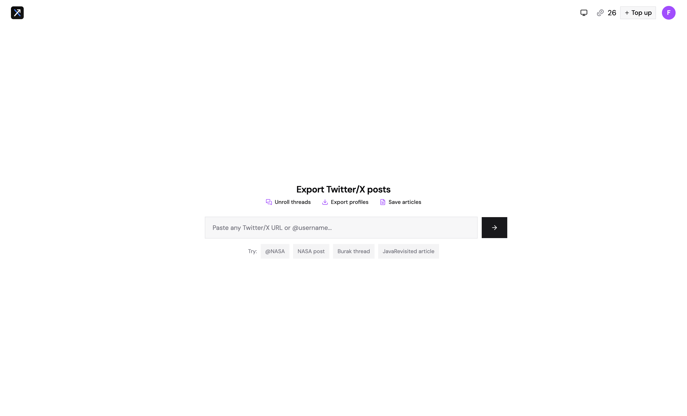
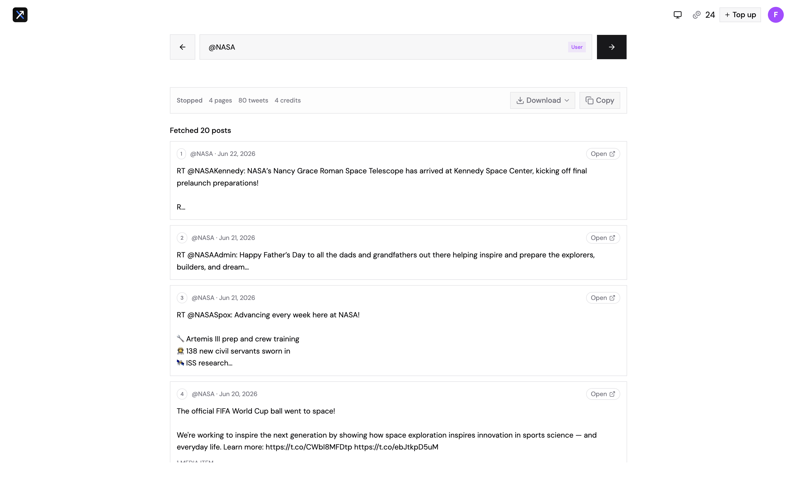
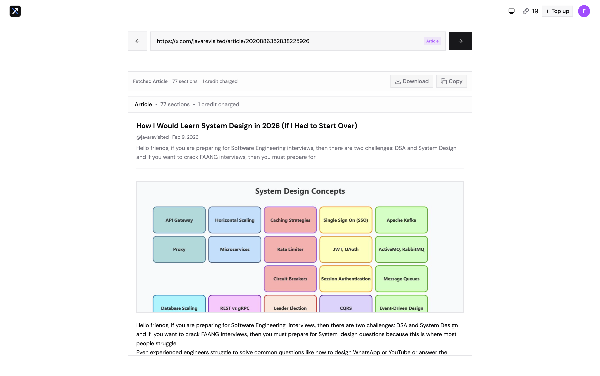
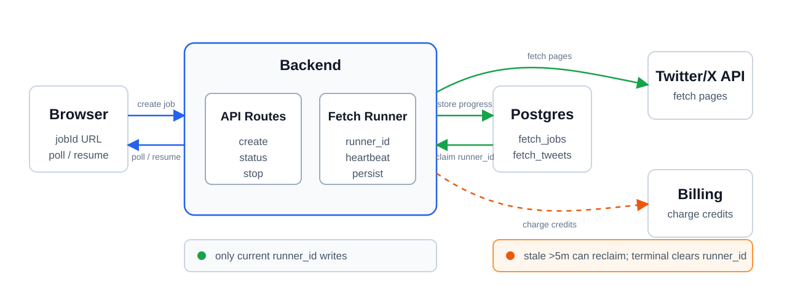

# Xport

Xport exports X (ex-Twitter) posts, threads, user timelines, and articles from a web app, with CLI scripts for local data extraction.

Xport is built around resumable export jobs. A browser creates a PostgreSQL-backed job, the server runs a disposable in-process worker to fetch pages from the Social API, and each page writes progress, cursors, credits, and fetched posts back to Postgres. If the process dies or the browser reloads, the job can be resumed from its `jobId` and stored `next_cursor`.

## Features

- Export threads from a tweet URL or ID.
- Export user posts from `@`/username or profile URL.
- Export X articles from article tweet URLs.
- Preview fetched content and media before export.
- Download Markdown and JSON where supported.
- Stop long-running fetches and export partial results.
- Resume background exports from a `jobId` URL.
- Start exports from direct links such as `xport.frixaco.com/x.com/...` and `xport.frixaco.com/twitter.com/...`.

## Demo

| Home                                                             | Stopped user fetch                                                                    | Article fetch                                                            |
| ---------------------------------------------------------------- | ------------------------------------------------------------------------------------- | ------------------------------------------------------------------------ |
|  |  |  |

## Architecture



- **Web app:** TanStack Start, TanStack Router, React, shadcn/ui, Tailwind, Nitro.
- **API:** server routes under `web/src/routes/api`.
- **Jobs:** PostgreSQL-backed fetch jobs and tweet snapshots.
- **Billing:** better-auth and Polar credits.
- **CLI:** Node.js/TypeScript scripts in `cli`.
- **Workspace:** pnpm workspaces.

Social API access stays server-side through `X_API_URL` and `X_API_KEY`.

The main backend state machine lives in `web/src/lib/fetch-job.ts`: create, claim, fetch, store, charge, stop, resume, complete, and fail. A runner claims work with an internal `runner_id`, writes progress only while it owns the job, and clears `runner_id` when the job reaches `completed`, `stopped`, or `failed`.

## Routes

- `/` - main export UI.
- `/x.com/<path>` and `/twitter.com/<path>` - direct-export redirects.
- `/auth-error` and `/checkout/success` - utility redirects.
- `/api/*` - server API routes.

## Exports

| Source     | Formats        | Filename                         |
| ---------- | -------------- | -------------------------------- |
| Thread     | Markdown, JSON | `<username>-thread.<ext>`        |
| User posts | Markdown, JSON | `<username>-user-posts.<ext>`    |
| Partial    | Markdown, JSON | Adds `-partial` before extension |
| Article    | Markdown       | `<sanitized-article-title>.md`   |

## Local Development

Requirements:

- Node.js 24.x
- pnpm 11.x
- PostgreSQL
- OAuth credentials for local sign-in
- Polar credentials
- Social API credentials

```bash
pn install
pn run db:migrate
pn run dev
```

Useful commands:

```bash
pn run build
pn run check
pn run lint
pn run format
pn run db:generate
pn run db:migrate
```

## Environment

Core:

- `DATABASE_URL`
- `BETTER_AUTH_URL`
- `BETTER_AUTH_SECRET`
- `SITE_URL`
- `X_API_URL`
- `X_API_KEY`

OAuth:

- `GITHUB_CLIENT_ID`
- `GITHUB_CLIENT_SECRET`
- `GOOGLE_CLIENT_ID`
- `GOOGLE_CLIENT_SECRET`

Polar:

- `POLAR_ENV`
- `POLAR_ACCESS_TOKEN` or `SANDBOX_POLAR_ACCESS_TOKEN`
- `POLAR_WEBHOOK_SECRET`
- `POLAR_CREDITS_50_CREDITS_PRODUCT_ID` or `SANDBOX_POLAR_CREDITS_50_CREDITS_PRODUCT_ID`
- `POLAR_CREDITS_500_CREDITS_PRODUCT_ID` or `SANDBOX_POLAR_CREDITS_500_CREDITS_PRODUCT_ID`

Analytics:

- `PUBLIC_POSTHOG_KEY`
- `PUBLIC_POSTHOG_HOST`

## Deployment

Production runs on Railway at `https://xport.frixaco.com`.

Railway uses `railway.json`:

- Build: `pn build`
- Start: `pn start`
- Healthcheck: `/`

```bash
railway service xport-web
railway up --detach
railway service status
railway logs
```

Database schema is managed with Drizzle:

- Schema: `web/src/db/schema.ts`
- Migrations: `web/migrations/`
- Generate migrations: `pn run db:generate`
- Apply migrations: `pn run db:migrate`

## CLI

CLI scripts read `cli/.env`; see `cli/.env.example`.

```bash
pn --filter cli fetch-thread -- <tweet-url-or-id>
pn --filter cli fetch-article -- <tweet-url-or-id>
pn --filter cli fetch-posts-by-username -- <username>
pn --filter cli fetch-user-info -- <username>
pn --filter cli fetch-bookmarks
pn --filter cli exec tsx json-to-text.ts <input.json>
```

## License

MIT License.
