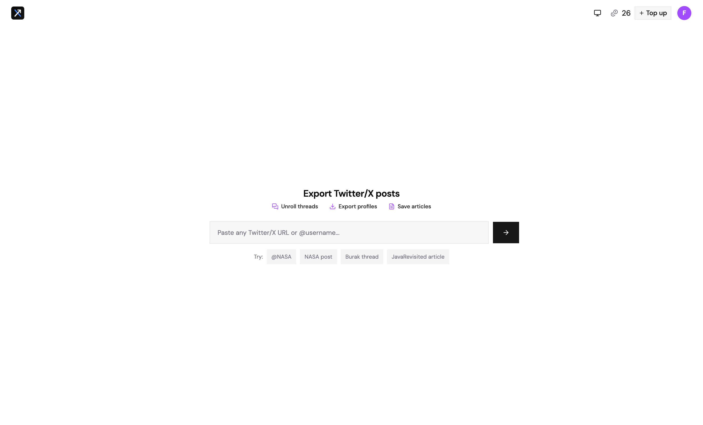
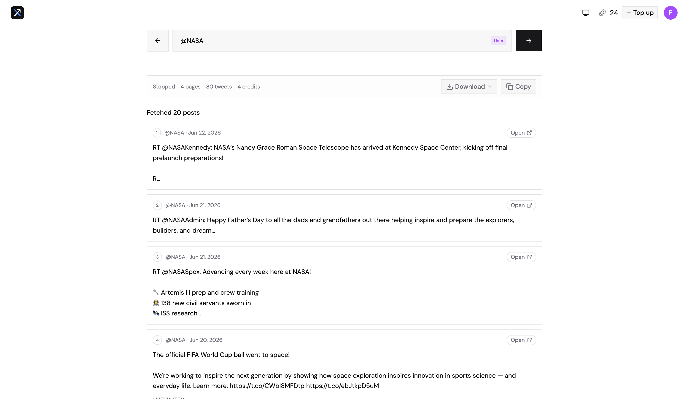
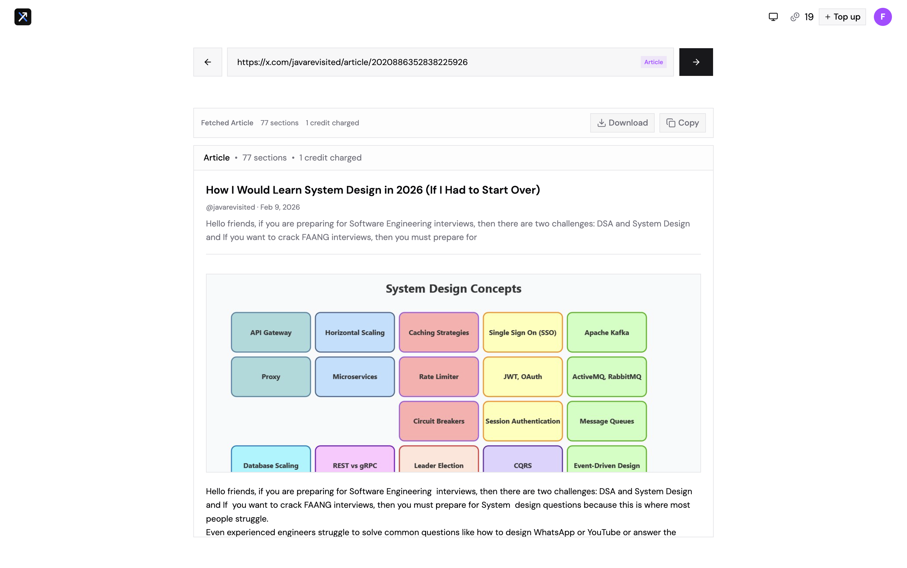
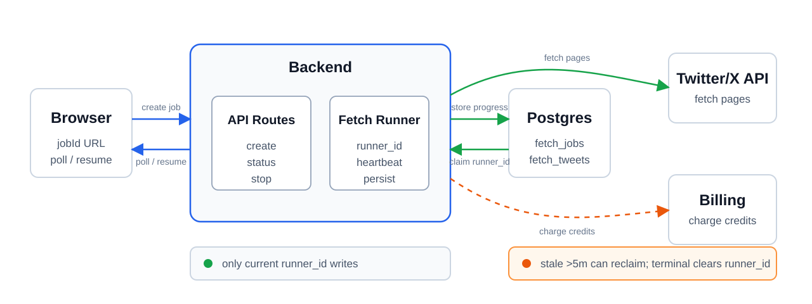

# Xport

Xport exports X posts, threads, user timelines, and articles — as Markdown or JSON — from a web app, a direct link, or a CLI.

- **Live app:** [xport.frixaco.com](https://xport.frixaco.com)
- **CLI:** [`@frixaco/xport` on npm](https://www.npmjs.com/package/@frixaco/xport)

Xport is built around **resumable export jobs**. A browser creates a PostgreSQL-backed job, the server runs a disposable in-process worker to fetch pages from the upstream X data API, and each page writes progress, cursors, credits, and fetched posts back to Postgres. If the process dies or the browser reloads, the job can be resumed from its `jobId` and stored `next_cursor`.

## Demo

| Home                                                             | Stopped user fetch                                                                    | Article fetch                                                            |
| ---------------------------------------------------------------- | ------------------------------------------------------------------------------------- | ------------------------------------------------------------------------ |
|  |  |  |

## Features

- Export threads from a tweet URL or ID.
- Export user posts and replies from `@`/username or profile URL.
- Export X articles from article tweet URLs.
- Export from the terminal with the [`xport` CLI](https://www.npmjs.com/package/@frixaco/xport).
- Preview fetched content and media before export.
- Download Markdown and JSON where supported.
- Stop long-running fetches and export partial results.
- Resume background exports from a `jobId` URL.
- Start exports from direct links such as `xport.frixaco.com/x.com/...` and `xport.frixaco.com/twitter.com/...`.

## Architecture



- **Web app:** TanStack Start, TanStack Router, React, shadcn/ui, Tailwind, Nitro.
- **API:** server routes under `web/src/routes/api`.
- **Jobs:** PostgreSQL-backed fetch jobs and tweet snapshots.
- **Billing:** better-auth and Polar credits.
- **CLI:** server-backed TypeScript CLI in `cli/src`.
- **Shared core:** pure parsing, normalization, credit, and export-formatting helpers in `core`.
- **Workspace:** pnpm workspaces.

The upstream X data API is only reachable server-side, through `X_API_URL` and `X_API_KEY`.

The main backend state machine lives in `web/src/lib/fetch-job.ts`: create, claim, fetch, store, charge, stop, resume, complete, and fail. A runner claims work with an internal `runner_id`, writes progress only while it owns the job, and clears `runner_id` when the job reaches `completed`, `stopped`, or `failed`.

Routes:

- `/` - main export UI.
- `/x.com/<path>` and `/twitter.com/<path>` - direct-export redirects.
- `/auth-error` and `/checkout/success` - utility redirects.
- `/api/*` - server API routes.

### Production safeguards

- Job status, tweets, stop actions, and checkout status are available only to the authenticated owner. Unknown and cross-user resource IDs receive the same not-found response.
- Browser mutations require a same-origin request (CSRF protection); bearer-authenticated CLI requests remain supported. Client errors use stable public codes — raw upstream payloads, provider diagnostics, and persisted job exception messages stay server-side.
- Abuse is bounded: at most two queued or running jobs per account (serialized in PostgreSQL), 30 export preflights per minute per account, 30-second upstream timeouts, a 100-page/15-minute runner cap that preserves partial results, and one-hour retention for terminal jobs (expired rows are removed opportunistically during job creation).

## Exports

| Source        | Formats        | Filename                         |
| ------------- | -------------- | -------------------------------- |
| Thread        | Markdown, JSON | `<username>-thread.<ext>`        |
| User timeline | Markdown, JSON | `<username>-user-posts.<ext>`    |
| User replies  | Markdown, JSON | `<username>-replies.<ext>`       |
| Partial       | Markdown, JSON | Adds `-partial` before extension |
| Article       | Markdown       | `<sanitized-article-title>.md`   |

## Local Development

Requirements: Node.js 24.x, pnpm 11.x, PostgreSQL.

```bash
pn install
pn run db:migrate
pn run dev
```

The app needs environment variables to boot — see [Environment](#environment). The minimal set to sign in and run an export: `DATABASE_URL`, `BETTER_AUTH_URL`, `BETTER_AUTH_SECRET`, one OAuth provider (GitHub or Google), and `X_API_URL`/`X_API_KEY`. PostHog and Polar are optional; without Polar credits, grants can be issued locally with `pn --filter web run credits:grant -- <email> <credits> "reason"`.

Useful commands:

```bash
pn run build
pn run check
pn run lint
pn run format
pn run db:generate
pn run db:migrate
```

## Environment

Required:

- `DATABASE_URL` - PostgreSQL connection string.
- `BETTER_AUTH_URL` - origin used for auth; must match the deployed domain in production.
- `BETTER_AUTH_SECRET` - auth secret.
- `X_API_URL`, `X_API_KEY` - upstream X data API; server-side only.
- `GITHUB_CLIENT_ID` / `GITHUB_CLIENT_SECRET` or `GOOGLE_CLIENT_ID` / `GOOGLE_CLIENT_SECRET` - at least one OAuth provider for sign-in.

Optional:

- `SITE_URL` - canonical origin for SEO metadata; falls back to `BETTER_AUTH_URL`, then `http://localhost:3000`.
- Polar (billing) - `POLAR_ENV`, `POLAR_ACCESS_TOKEN` or `SANDBOX_POLAR_ACCESS_TOKEN`, `POLAR_WEBHOOK_SECRET`, `POLAR_CREDITS_50_CREDITS_PRODUCT_ID` or `SANDBOX_POLAR_CREDITS_50_CREDITS_PRODUCT_ID`, `POLAR_CREDITS_500_CREDITS_PRODUCT_ID` or `SANDBOX_POLAR_CREDITS_500_CREDITS_PRODUCT_ID`. Signup credits are granted locally after user creation, with an idempotent retry on session creation to recover interrupted signups. Purchased credits are granted by the verified Polar `order.paid` webhook; enable that event at `/api/auth/polar/webhooks`. The legacy product environment-variable names map to 125 and 1250 credits respectively; see `web/src/lib/billing-products.ts`.
- `BILLING_MAINTENANCE=true` - blocks new billing requests, signup/purchase processing, and Polar delivery during cutover; job stop requests remain available.
- PostHog (analytics) - `PUBLIC_POSTHOG_KEY`, `PUBLIC_POSTHOG_HOST`. Omitted safely when unset.

## Deployment

Production runs on Railway at `https://xport.frixaco.com`.

Railway uses `railway.json`:

- Build: `pn build`
- Start: `pn start`
- Healthcheck: `/`

```bash
railway service xport-web
railway up --detach
railway service status
railway logs
```

Database schema is managed with Drizzle:

- Schema: `web/src/db/schema.ts`
- Migrations: `web/migrations/`
- Generate migrations: `pn run db:generate`
- Apply migrations: `pn run db:migrate`

## CLI

The CLI (`cli/src`, published as [`@frixaco/xport`](https://www.npmjs.com/package/@frixaco/xport)) calls the deployed or local Xport server APIs; Social API credentials stay server-side.

Install from npm:

```bash
npm install -g @frixaco/xport
xport login
xport export --format markdown --out . "https://x.com/burakeregar/status/2020852442230120752"
xport posts --format markdown --out . "@frixaco"
xport replies --format markdown --out . "@frixaco"
xport stop <jobId>
```

Prepare the npm package locally:

```bash
pn --filter @frixaco/xport build
pn --filter @frixaco/xport pack --pack-destination /tmp
```

Workspace usage:

```bash
pn --filter @frixaco/xport xport login
pn --filter @frixaco/xport xport whoami
pn --filter @frixaco/xport xport credits
pn --filter @frixaco/xport xport export --format markdown --out . "https://x.com/burakeregar/status/2020852442230120752"
pn --filter @frixaco/xport xport export --format json --stdout "@frixaco"
pn --filter @frixaco/xport xport posts --format markdown --out . "@frixaco"
pn --filter @frixaco/xport xport replies --format json --stdout "@frixaco"
pn --filter @frixaco/xport xport stop <jobId>
pn --filter @frixaco/xport xport logout
```

CLI export options must come before the input: `xport export [options] <input>` is the only supported form. Thread and user exports print `Job ID: <uuid>` to stderr as soon as the resumable job is created, and `xport stop <jobId>` stops that job from another terminal. Auth uses the Better Auth device code flow; tokens are stored at `~/.config/xport/config.json` with `0600` permissions. For automation, set `XPORT_TOKEN`; for local servers, set `XPORT_BASE_URL`.

Older local extraction scripts in `cli/` talk to the upstream API directly and read `cli/.env`; see `cli/.env.example`.

## License

MIT.

## Automated tests

```bash
pnpm --filter web exec playwright install chromium  # once per machine
pnpm test                    # logic + PostgreSQL + HTTP/CLI + browser, no provider credentials
pnpm test:live               # real X API + Polar sandbox checkout/webhook/delivery
pnpm test:oauth              # real GitHub/Google login using signed-in Helium on :9222
pnpm check
```

Docker must be running. Test commands build the app and use a disposable PostgreSQL database, removed on exit. Run them sequentially because they share build output. Keep ports 3108/3210/3211 free for routine tests and 3000 for live/OAuth tests (`XPORT_TEST_PORT` overrides it).

The routine suite covers exports/downloads, stop/reload/recovery, billing, access controls, OAuth callbacks, CLI flows, and public UI. It uses real app routes and PostgreSQL with mocked providers. GitHub Actions runs this suite on pushes/PRs; browser coverage is Chromium, including a mobile viewport.

- **Live:** Set sandbox Polar and X API credentials in `web/.env.local` with `POLAR_ENV=sandbox`. Disposable customers use aliases from `XPORT_TEST_EMAIL` or the first local database user's email; personal credits are not spent. Tests cover real exports and checkout/webhook/delivery, capped at 50 X API calls. Full exports use `@frixaco`; stop/reload checks save at most two pages. Test customers are deleted; sandbox orders remain.
- **OAuth:** Set OAuth credentials and the sandbox token in `web/.env.local`. Use signed-in Helium on `http://127.0.0.1:9222` (`XPORT_BROWSER_CDP` overrides it), with callbacks registered at `http://localhost:3000/api/auth/callback/github` and `/google`. Update callbacks if changing the port. Tests restore localhost auth cookies afterward; avoid another localhost Better Auth app during the run. Expired sessions or MFA may need interaction.

Reports are in `web/playwright-report/`; failure traces/screenshots are in `web/test-results/`. Artifacts may contain private data and are ignored by Git. OAuth capture is disabled for the personal browser. Live and OAuth tests run explicitly, outside CI.

For a focused billing-only run against a manually provisioned local `*_test` database:

```bash
DATABASE_URL=postgresql://<user>:<password>@127.0.0.1:5432/xport_billing_test pnpm --filter web test:billing
```

## Credit ledger

The schema adds `user.credit_balance` and `xport_credit_transactions`. A ledger row records each grant/debit and its optional Polar delivery payload. Nitro runs `billing-delivery` every minute; failed or interrupted deliveries retry using the same operation key. `pnpm --filter web credits:deliver` also runs delivery manually. Neither path changes local balances during delivery.

Direct article, thread, user-info, and user-tweets APIs now require `POST` and an `Idempotency-Key` header (1–128 letters, digits, `_`, or `-`). Query parameters are unchanged. Reuse the key only when retrying the same request. The ledger retains the paid direct response so a lost response can be replayed without another fetch or debit. Browser and CLI article callers generate a fresh key per export; existing CLI releases using GET must be updated alongside the server.

## Billing cutover

Prepare and test the release first. This is a single maintenance-window cutover, not parallel Polar/local spending. All script commands require `DATABASE_URL` in the shell; snapshot and delivery additionally use the configured Polar token/environment. Node scripts do not automatically load `.env.local` (use Node's `--env-file` locally if needed).

1. Block new billing requests at the deployment ingress before stopping the old release: the old release does not recognize the maintenance flag. Drain or stop queued/running jobs. Pause manual grants and checkout/signup processing; allow rejected webhooks to retry later.
2. Apply `pnpm db:migrate`, then start the new release with `BILLING_MAINTENANCE=true`. Keep ingress maintenance active. Do not expose a zero-balance cutover before import.
3. With `BILLING_MAINTENANCE=true` in the script environment, run `pnpm --filter web credits:migrate snapshot /secure/path/credits.json`. Snapshot collection is read-only and refuses to overwrite an existing file. It fails on unmapped customers instead of guessing by email.
4. Review every snapshot row. Resolve missing/deleted/duplicate customers explicitly (a genuinely missing customer may use `polarCustomerId: null` and a reviewed opening balance). Wait for in-flight checkouts and Polar meter changes to settle. `includedOrderIds` must list exactly the paid purchases represented in `originalBalance`; late purchases excluded from the balance must be removed from this list so their webhook can grant them. Mark each reviewed row `confirmed: true`. Reconcile any negative Polar balance separately: importing zero locally does not repair it externally.
5. Run `pnpm --filter web credits:migrate import /secure/path/credits.json`. The import is atomic and replay-safe; it rejects an account with other local ledger activity. Original balances and included order IDs stay in opening-entry metadata, and imports never queue Polar grants.
6. Run `web/scripts/reconcile-credits.sql`, verify the local balances, then disable maintenance and replay outstanding purchase webhooks. Imported purchase IDs and historical signup grants are skipped. Check pending deliveries and Railway logs after reopening ingress.

For a manual positive adjustment, use a stable operation key and reuse it on retries:

```bash
pnpm --filter web credits:grant user@example.com 50 "Support adjustment" --key support-ticket-123
```

Do not edit balances directly or send standalone negative Polar usage events. Reporting behavior follows Polar's [event ingestion API](https://polar.sh/docs/api-reference/events/ingest); purchases use [order.paid](https://polar.sh/docs/api-reference/webhooks/order.paid).
